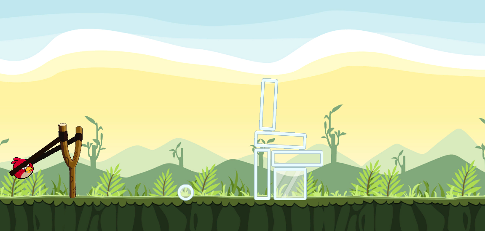
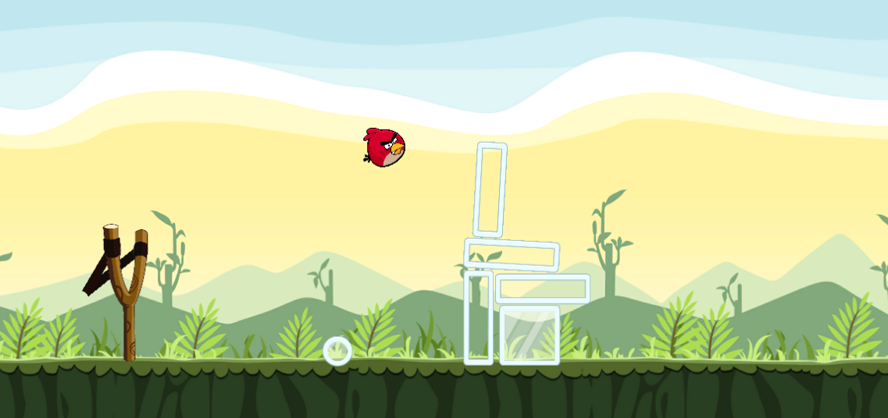

# Mad Birds

---

### Table of Contents

- [Description](#description)
- [How To Play](#how-to-use)
- [Learned](#learned)
- [Author Info](#author-info)

---

## Description
Sling shot game inspired by "Angry birds" the more you hold sling back the more power your bird will have.

---

## How To Play
> Drag mouse/finger across slingshot and let go when achieved wanted power  

---

## Learned 
- how to use Physics Material 2D
- how to use Line Renderer
- to make mouse/finger as a Control

---

## Author Info

- Twitter - [@MarceliKumiers1](https://twitter.com/MarceliKumiers1)
- LinkedIn - [Marceli Kuśmierski](https://www.linkedin.com/in/marceli-ku%C5%9Bmierski-321969165/)

[Back To The Top](#Mad-Birds)
